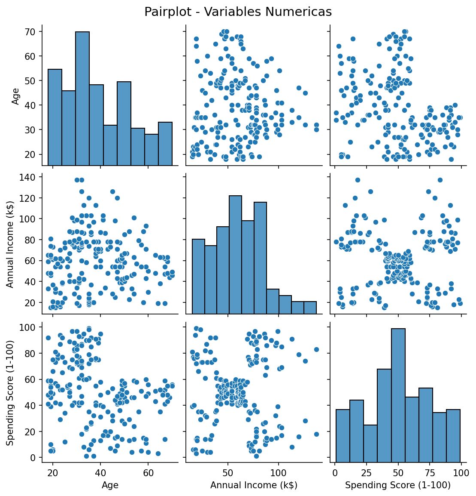
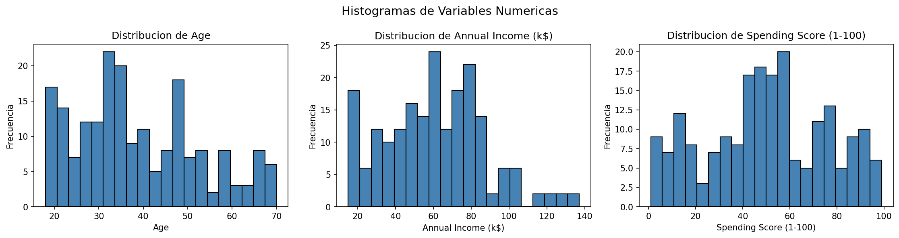
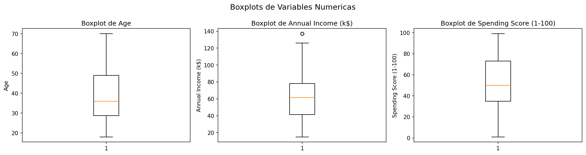
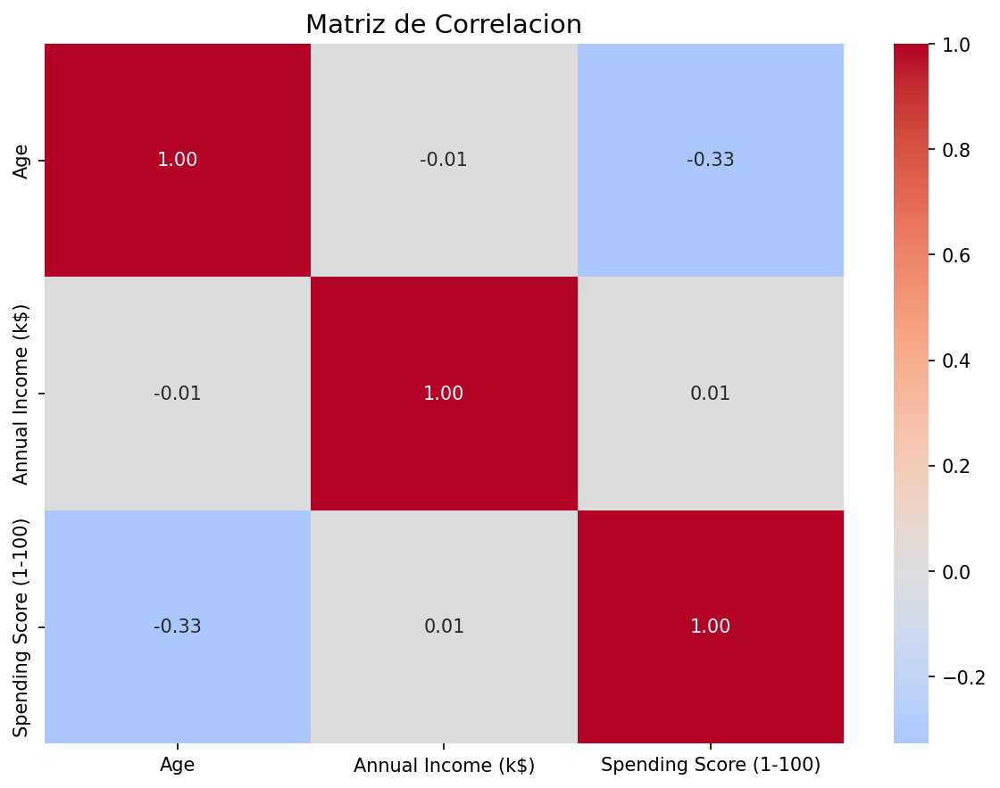
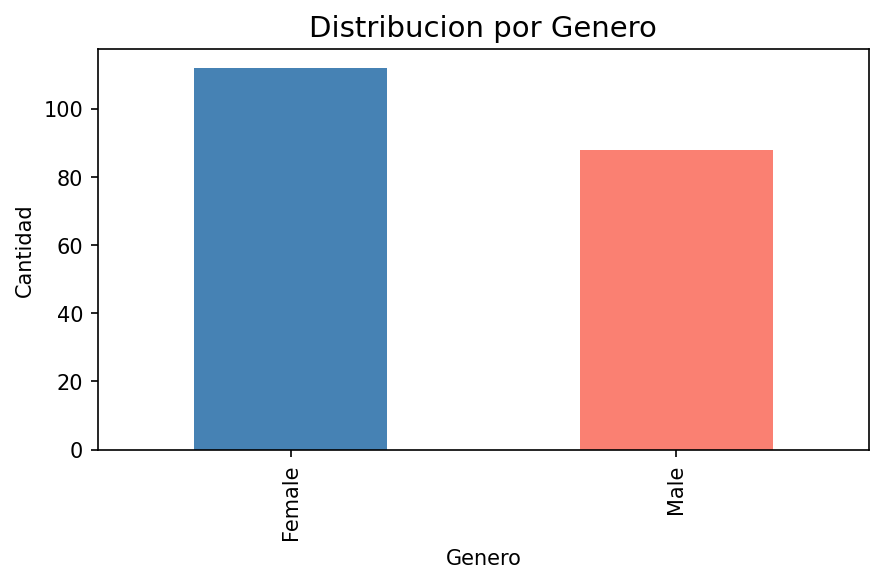

# Segmentacion de Clientes - Modelos No Supervisados

**Maestria en Inteligencia Artificial - UEES | Aprendizaje Automatico - Semana 3**

epositorio para la materia de **Aprendizaje Automatico** - Maestria en Inteligencia Artificial, UEES.

---
Estudiante:

Ingeniero Gonzalo Mejia Alcivar

Docente: Ingeniera GLADYS MARIA VILLEGAS RUGEL

Fecha de Ultima Actualizacion: 10 Febrero 2026

## Objetivo

Aplicar modelos de clustering (K-Means y DBSCAN) y reduccion de dimensionalidad (PCA y t-SNE) para segmentar perfiles de clientes en plataformas tecnologicas, visualizando resultados y analizando los patrones detectados.

## Dataset

**Mall_Customers.csv** - Dataset de 200 clientes de un centro comercial con las siguientes variables:

| Variable | Descripcion |
|---|---|
| CustomerID | Identificador unico del cliente |
| Gender | Genero del cliente |
| Age | Edad del cliente (18-70) |
| Annual Income (k$) | Ingreso anual en miles de dolares (15-137) |
| Spending Score (1-100) | Puntaje de gasto asignado por el centro comercial (1-99) |

## Estructura del Proyecto

```
AA_MaestriaUEES_Semana3_Personal/
├── Data/                  # Dataset
│   └── Mall_Customers.csv
├── Models/                # Modelos entrenados
├── notebooks/             # Jupyter notebooks
│   └── semana3_Modelos_NoSupervisados.ipynb
├── results/               # Graficos y resultados exportados
│   ├── 01_preparacion_entorno_reporte.txt
│   ├── 02_pairplot.png
│   ├── 02_histogramas.png
│   ├── 02_boxplots.png
│   ├── 02_correlacion.png
│   ├── 02_distribucion_genero.png
│   └── 02_EDA_reporte.txt
├── scr/                   # Scripts de Python
│   ├── 01_Preparacion_Entorno.py
│   └── 02_CargaDatos_EDA.py
├── Objetivos.txt
├── requirements.txt
└── README.md
```

## Instalacion

```bash
pip install -r requirements.txt
```

## Etapas del Proyecto

1. **Preparacion del Entorno** - Instalacion y verificacion de librerias
2. **Carga y Analisis Exploratorio** - Lectura del dataset y estadisticas descriptivas
3. **Visualizacion de Distribucion** - Pairplots y graficos de las variables
4. **Preprocesamiento** - Escalado de variables con StandardScaler
5. **Implementacion de Clustering**
   - 5.1 K-Means Clustering (metodo del codo, k=4)
   - 5.2 DBSCAN (eps=0.6, min_samples=5)
6. **Reduccion de Dimensionalidad**
   - 6.1 PCA (2 componentes)
   - 6.2 t-SNE (2 componentes)
7. **Analisis y Conclusiones**

## Resultados - Etapa 1: Preparacion del Entorno

Script: `scr/01_Preparacion_Entorno.py`

Se verifico la instalacion correcta de todas las librerias necesarias y la estructura de carpetas del proyecto. El reporte completo se genera automaticamente en `results/01_preparacion_entorno_reporte.txt`.

**Librerias verificadas:**

| Libreria | Uso en el proyecto |
|---|---|
| pandas | Manejo y manipulacion de datos |
| numpy | Operaciones numericas |
| matplotlib | Visualizacion de graficos |
| seaborn | Visualizacion estadistica avanzada |
| scikit-learn | Clustering (KMeans, DBSCAN), PCA, t-SNE, StandardScaler |

**Estructura de carpetas verificada:** Data, Models, notebooks, results, scr

---

## Resultados - Etapa 2: Carga y Analisis Exploratorio (EDA)

Script: `scr/02_CargaDatos_EDA.py`

Se cargo el dataset **Mall_Customers.csv** (200 registros, 5 columnas) y se realizo un analisis exploratorio completo. No se encontraron valores nulos.

### Pairplot - Relacion entre variables



### Histogramas - Distribucion de variables



### Boxplots - Deteccion de outliers



### Matriz de Correlacion



### Distribucion por Genero



---

## Analisis y Conclusiones

### Cuantos clusters parecen ser optimos segun K-Means?

Segun el metodo del codo, **4 clusters** es el numero optimo. A partir de k=4 la inercia deja de disminuir significativamente, indicando que agregar mas clusters no aporta una mejora sustancial en la segmentacion.

### Como se comparan los resultados entre K-Means y DBSCAN?

| Aspecto | K-Means (k=4) | DBSCAN (eps=0.6, min_samples=5) |
|---|---|---|
| Clusters encontrados | 4 | 2 + ruido |
| Requiere definir k | Si | No |
| Manejo de outliers | No los detecta | Los etiqueta como -1 |
| Forma de clusters | Esfericos | Arbitraria |

K-Means logra una segmentacion mas granular (4 perfiles distintos), mientras que DBSCAN identifica 2 grupos principales y clasifica como ruido a los clientes con patrones atipicos (ingresos altos y gasto bajo). DBSCAN es mas conservador pero util para detectar outliers.

### Que aporta PCA/t-SNE a la interpretacion de los clusters?

- **PCA** reduce las 3 variables a 2 componentes principales preservando la maxima varianza. Permite visualizar la separacion entre clusters en un plano 2D y confirmar que los grupos de K-Means estan bien diferenciados.
- **t-SNE** preserva la estructura local de los datos, mostrando agrupaciones mas compactas y separadas visualmente. Es superior para visualizar clusters densos y revelar patrones no lineales que PCA no captura.

Ambas tecnicas complementan el analisis: PCA para una vision global y t-SNE para una vision local detallada.

### Que tipo de perfiles de clientes se detectaron?

| Cluster | Edad Promedio | Ingreso Promedio (k$) | Gasto Promedio | Perfil |
|---|---|---|---|---|
| 0 | 54 | 48 | 40 | **Conservadores**: Edad mayor, ingreso e gasto moderados |
| 1 | 33 | 86 | 82 | **Premium**: Jovenes con alto ingreso y alto gasto |
| 2 | 25 | 40 | 60 | **Jovenes activos**: Baja renta pero gasto medio-alto |
| 3 | 39 | 87 | 20 | **Ahorradores**: Alto ingreso pero bajo gasto |

## Tecnologias Utilizadas

- Python 3.x
- pandas, numpy
- matplotlib, seaborn
- scikit-learn (KMeans, DBSCAN, PCA, TSNE, StandardScaler)
