# Segmentacion de Clientes - Modelos No Supervisados

## Maestria en Inteligencia Artificial - UEES / Aprendizaje Automatico - Semana 3

Repositorio para la materia de **Aprendizaje Automatico** - Maestria en Inteligencia Artificial, UEES.

---
Estudiante:

Ingeniero Gonzalo Mejia Alcivar

Docente: Ingeniera GLADYS MARIA VILLEGAS RUGEL

Fecha de Ultima Actualizacion: 10 Febrero 2026

## Objetivo

Aplicar modelos de clustering (K-Means y DBSCAN) y reduccion de dimensionalidad (PCA y t-SNE) para segmentar perfiles de clientes en plataformas tecnologicas, visualizando resultados y analizando los patrones detectados.

## Dataset

**Mall_Customers.csv** - Dataset de 200 clientes de un centro comercial con las siguientes variables:

| Variable | Descripcion |
| --- | --- |
| CustomerID | Identificador unico del cliente |
| Gender | Genero del cliente |
| Age | Edad del cliente (18-70) |
| Annual Income (k$) | Ingreso anual en miles de dolares (15-137) |
| Spending Score (1-100) | Puntaje de gasto asignado por el centro comercial (1-99) |

## Estructura del Proyecto

```
AA_MaestriaUEES_Semana3_Personal/
├── Data/                  # Dataset
│   └── Mall_Customers.csv
├── Models/                # Modelos entrenados
├── notebooks/             # Jupyter notebooks
│   └── semana3_Modelos_NoSupervisados.ipynb
├── results/               # Graficos y resultados exportados
│   ├── 01_preparacion_entorno_reporte.txt
│   ├── 02_pairplot.png
│   ├── 02_histogramas.png
│   ├── 02_boxplots.png
│   ├── 02_correlacion.png
│   ├── 02_distribucion_genero.png
│   ├── 02_EDA_reporte.txt
│   ├── 03_preprocesamiento_reporte.txt
│   ├── 03_comparacion_distribuciones.png
│   ├── 03_comparacion_boxplots.png
│   ├── 03_pairplot_escalado.png
│   ├── 04_metodo_del_codo.png
│   ├── 04_kmeans_income_vs_spending.png
│   ├── 04_kmeans_age_vs_spending.png
│   ├── 04_kmeans_age_vs_income.png
│   ├── 04_kmeans_reporte.txt
│   ├── 05_dbscan_income_vs_spending.png
│   ├── 05_dbscan_age_vs_spending.png
│   ├── 05_comparacion_kmeans_vs_dbscan.png
│   ├── 05_dbscan_reporte.txt
│   ├── 06_pca_kmeans_clusters.png
│   ├── 06_pca_varianza_explicada.png
│   ├── 06_pca_perfiles_clientes.png
│   ├── 06_pca_reporte.txt
│   ├── 07_tsne_kmeans_clusters.png
│   ├── 07_tsne_perfiles_clientes.png
│   ├── 07_comparacion_pca_vs_tsne.png
│   ├── 07_tsne_reporte.txt
│   ├── 08_resumen_visual.png
│   └── 08_analisis_reporte.txt
├── scr/                   # Scripts de Python
│   ├── 01_Preparacion_Entorno.py
│   ├── 02_CargaDatos_EDA.py
│   ├── 03_PreProcesamiento.py
│   ├── 04_K-Means.py
│   ├── 05_DBSCAN.py
│   ├── 06_PCA_RedDim.py
│   ├── 07_t-SNE_RedDim.py
│   └── 08_AnalisisBasico.py
├── Objetivos.txt
├── requirements.txt
└── README.md
```

## Instalacion

```bash
pip install -r requirements.txt
```

## Etapas del Proyecto

1. **Preparacion del Entorno** - Instalacion y verificacion de librerias
2. **Carga y Analisis Exploratorio** - Lectura del dataset y estadisticas descriptivas
3. **Visualizacion de Distribucion** - Pairplots y graficos de las variables
4. **Preprocesamiento** - Escalado de variables con StandardScaler
5. **Implementacion de Clustering**
   - 5.1 K-Means Clustering (metodo del codo, k=4)
   - 5.2 DBSCAN (eps=0.6, min_samples=5)
6. **Reduccion de Dimensionalidad**
   - 6.1 PCA (2 componentes)
   - 6.2 t-SNE (2 componentes)
7. **Analisis y Conclusiones**

## Resultados - Etapa 1: Preparacion del Entorno

Script: `scr/01_Preparacion_Entorno.py`

Se verifico la instalacion correcta de todas las librerias necesarias y la estructura de carpetas del proyecto. El reporte completo se genera automaticamente en `results/01_preparacion_entorno_reporte.txt`.

**Librerias verificadas:**

| Libreria | Uso en el proyecto |
| --- | --- |
| pandas | Manejo y manipulacion de datos |
| numpy | Operaciones numericas |
| matplotlib | Visualizacion de graficos |
| seaborn | Visualizacion estadistica avanzada |
| scikit-learn | Clustering (KMeans, DBSCAN), PCA, t-SNE, StandardScaler |

**Estructura de carpetas verificada:** Data, Models, notebooks, results, scr

---

## Resultados - Etapa 2: Carga y Analisis Exploratorio (EDA)

Script: `scr/02_CargaDatos_EDA.py`

Se cargo el dataset **Mall_Customers.csv** (200 registros, 5 columnas) y se realizo un analisis exploratorio completo. No se encontraron valores nulos.

### Pairplot - Relacion entre variables


### Histogramas - Distribucion de variables


### Boxplots - Deteccion de outliers


### Matriz de Correlacion


### Distribucion por Genero


---

## Resultados - Etapa 3: Preprocesamiento (StandardScaler)

Script: `scr/03_PreProcesamiento.py`

Se aplico **StandardScaler** a las 3 variables numericas (Age, Annual Income, Spending Score) para normalizarlas a media=0 y desviacion estandar=1. Esto es necesario porque K-Means y DBSCAN usan distancias euclidianas, y sin escalado las variables con rangos mayores dominarian el calculo.

### Comparacion de Distribuciones: Original vs Escalado

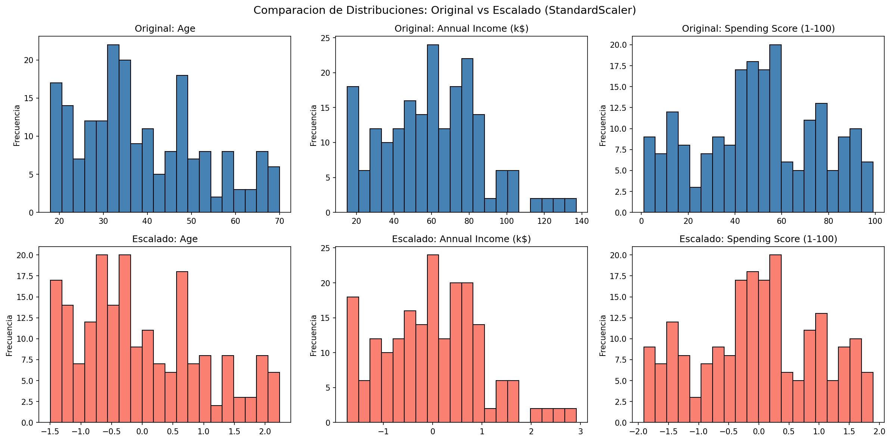

### Boxplots Comparativos: Original vs Escalado

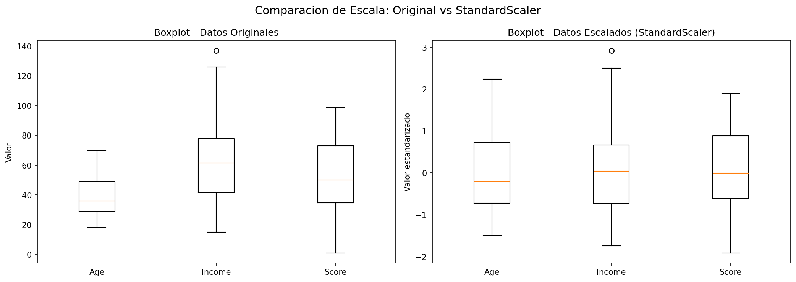

### Pairplot - Datos Escalados

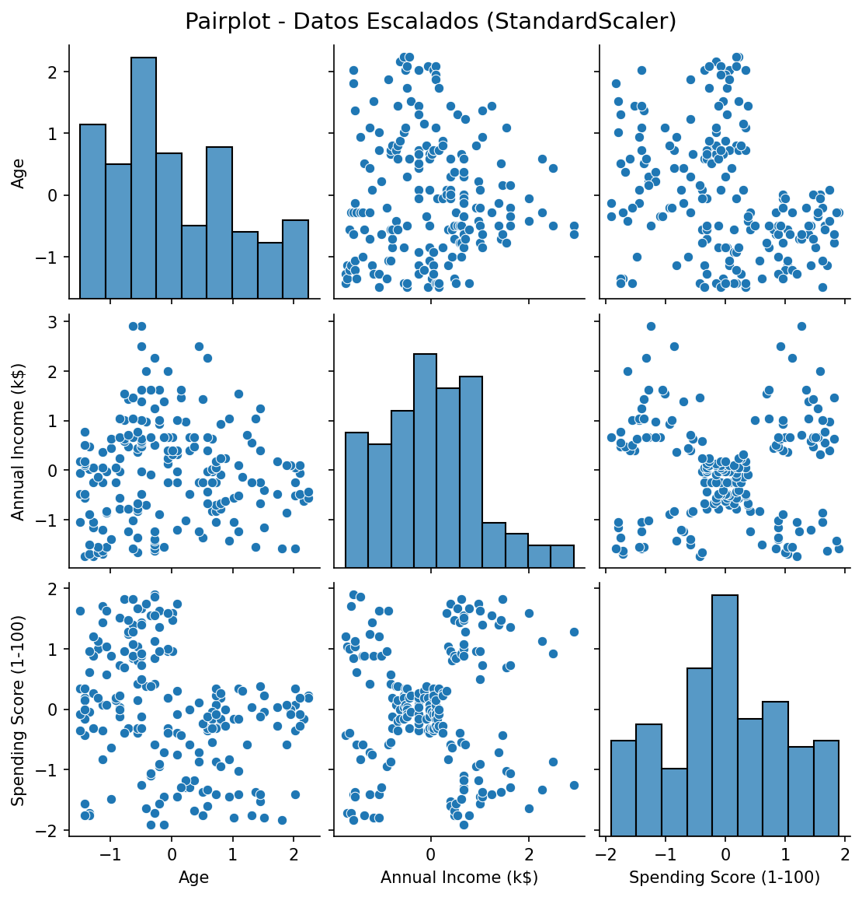

---

## Resultados - Etapa 4: K-Means Clustering

Script: `scr/04_K-Means.py`

Se aplico el **metodo del codo** evaluando de k=1 a k=9 clusters. El punto de inflexion se encuentra en **k=4**, donde la inercia deja de disminuir significativamente. Se entreno el modelo final con k=4 y se asignaron los clusters a cada cliente.

### Metodo del Codo

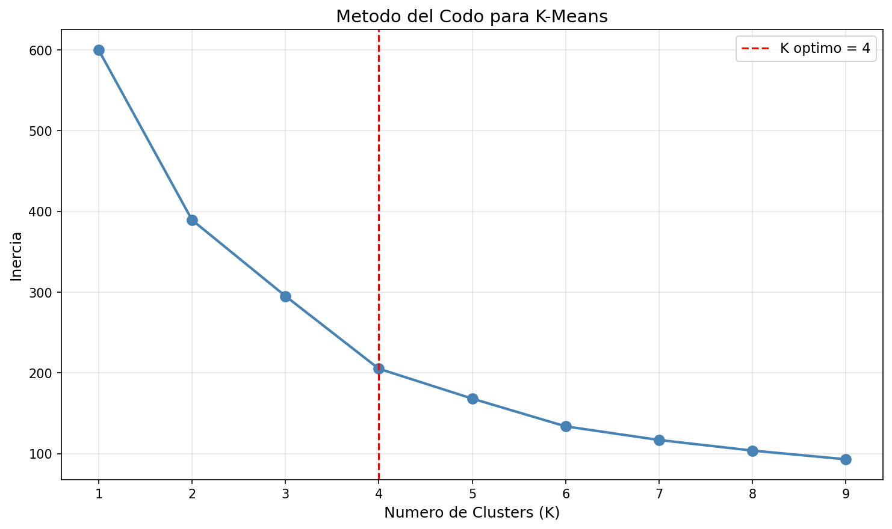

### Segmentacion: Income vs Spending Score

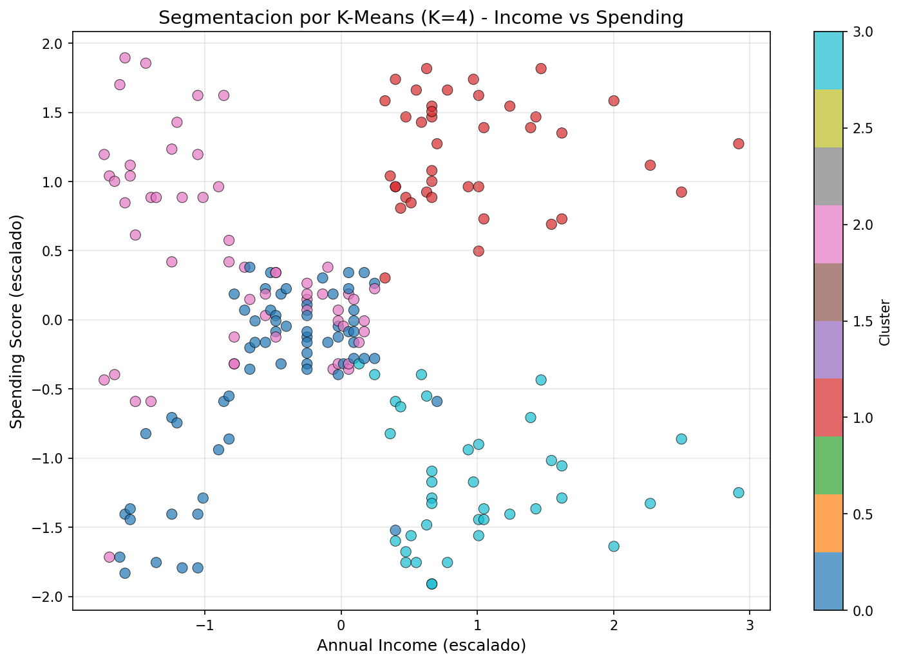

### Segmentacion: Age vs Spending Score

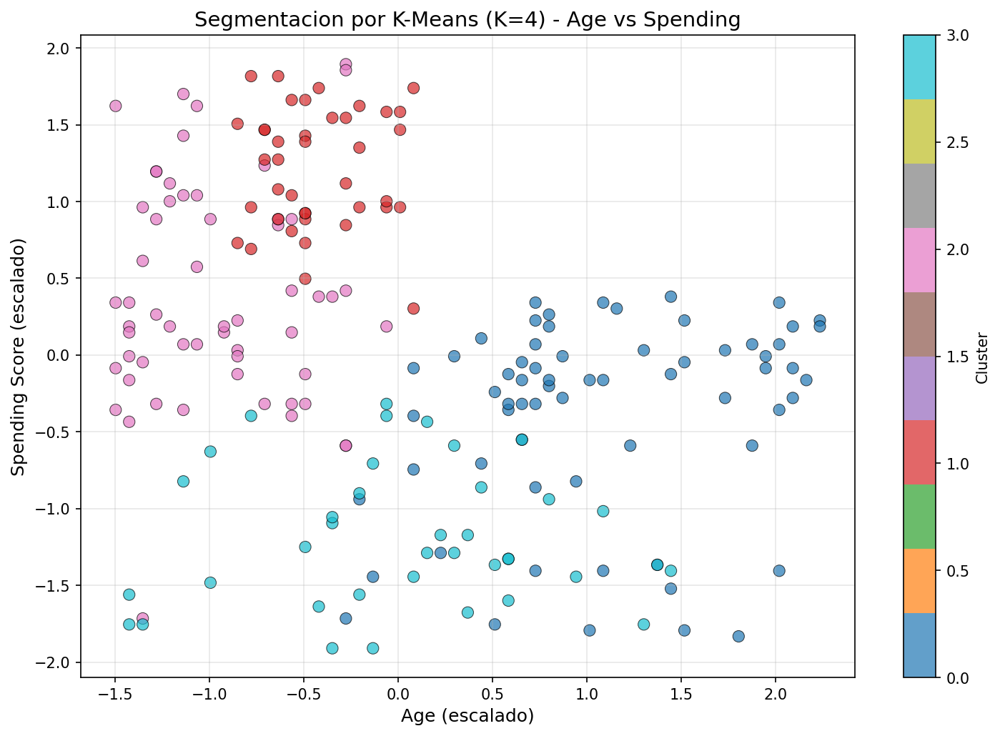

### Segmentacion: Age vs Income

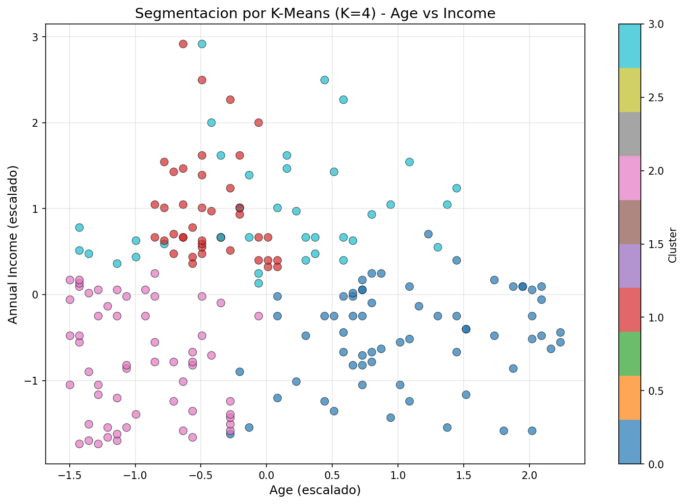

### Medias por Cluster (K-Means)

| Cluster | Edad Promedio | Ingreso Promedio (k$) | Gasto Promedio | Perfil |
| --- | --- | --- | --- | --- |
| 0 | 54 | 48 | 40 | **Conservadores**: Edad mayor, ingreso y gasto moderados |
| 1 | 33 | 86 | 82 | **Premium**: Jovenes con alto ingreso y alto gasto |
| 2 | 25 | 40 | 60 | **Jovenes activos**: Bajo ingreso pero gasto medio-alto |
| 3 | 39 | 87 | 20 | **Ahorradores**: Alto ingreso pero bajo gasto |

---

## Resultados - Etapa 5: DBSCAN Clustering

Script: `scr/05_DBSCAN.py`

Se aplico **DBSCAN** (eps=0.6, min_samples=5), un algoritmo basado en densidad que no requiere definir el numero de clusters. Encontro **2 clusters** y detecto automaticamente **outliers** (etiquetados como -1), que corresponden a clientes con patrones atipicos.

### Segmentacion DBSCAN: Income vs Spending Score

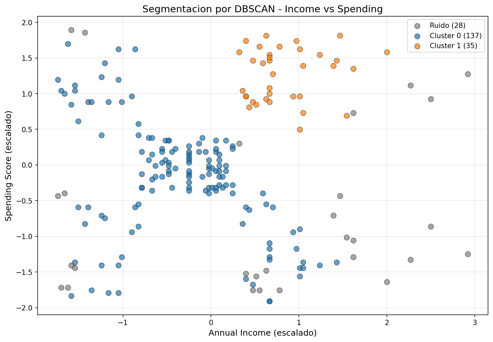

### Segmentacion DBSCAN: Age vs Spending Score

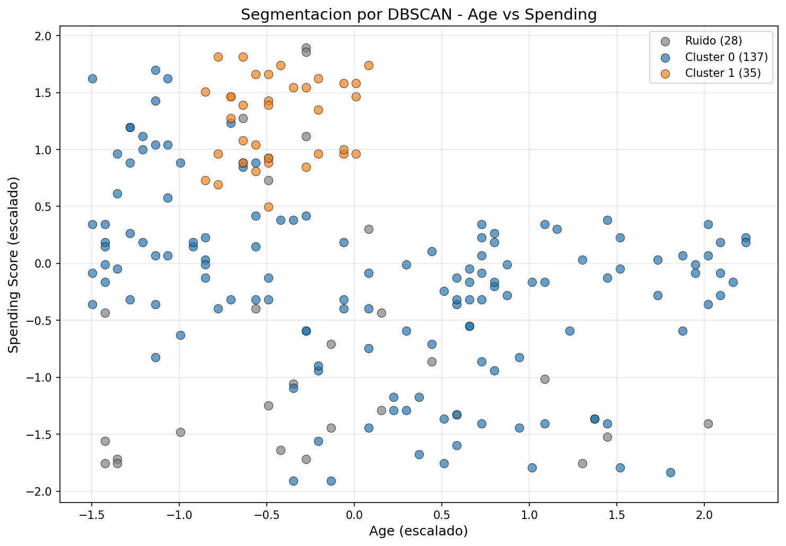

### Comparacion: K-Means vs DBSCAN

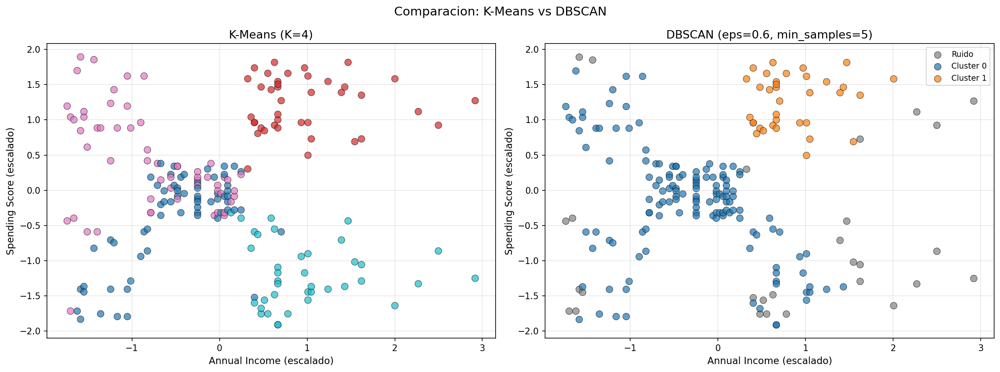

### Medias por Cluster (DBSCAN)

| Cluster | Edad Promedio | Ingreso Promedio (k$) | Gasto Promedio | Descripcion |
| --- | --- | --- | --- | --- |
| -1 (Ruido) | 36 | 77 | 33 | **Outliers**: Patrones atipicos, ingresos altos y gasto bajo |
| 0 | 41 | 52 | 45 | **Grupo principal**: Ingreso y gasto moderados |
| 1 | 33 | 83 | 83 | **Premium**: Alto ingreso y alto gasto |

---

## Resultados - Etapa 6: PCA - Reduccion de Dimensionalidad

Script: `scr/06_PCA_RedDim.py`

Se aplico **PCA** (Principal Component Analysis) para reducir las 3 variables originales a **2 componentes principales** (PC1 y PC2). Cada componente es una combinacion lineal de Age, Annual Income y Spending Score. La visualizacion utiliza los colores de los clusters de K-Means para confirmar la separacion de los grupos.

### PCA - Clusters K-Means

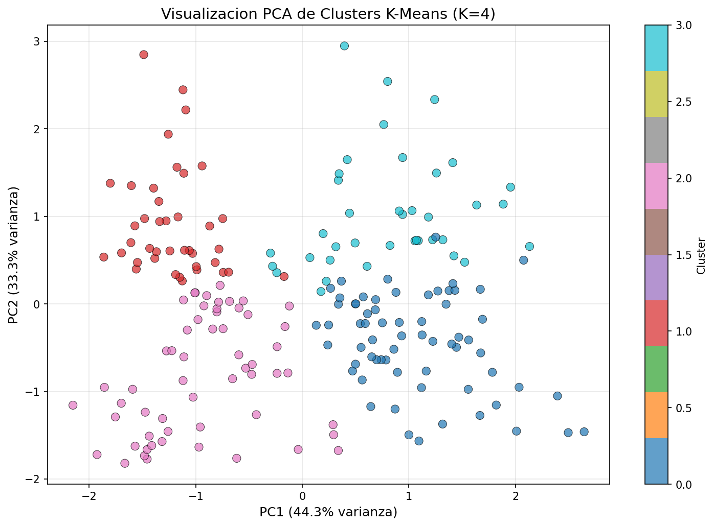

### Varianza Explicada por Componente

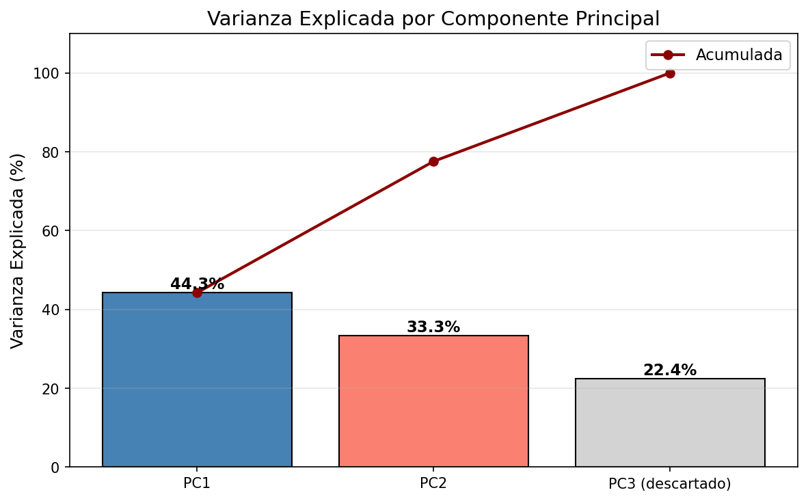

### PCA - Perfiles de Clientes

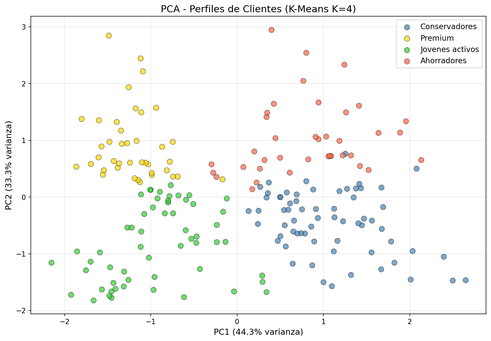

---

## Resultados - Etapa 7: t-SNE - Reduccion de Dimensionalidad

Script: `scr/07_t-SNE_RedDim.py`

Se aplico **t-SNE** (t-distributed Stochastic Neighbor Embedding) para reducir las 3 variables a **2 dimensiones**. A diferencia de PCA (lineal), t-SNE es un metodo **no lineal** que preserva la estructura local de los datos, generando agrupaciones mas compactas y visualmente separadas.

### t-SNE - Clusters K-Means

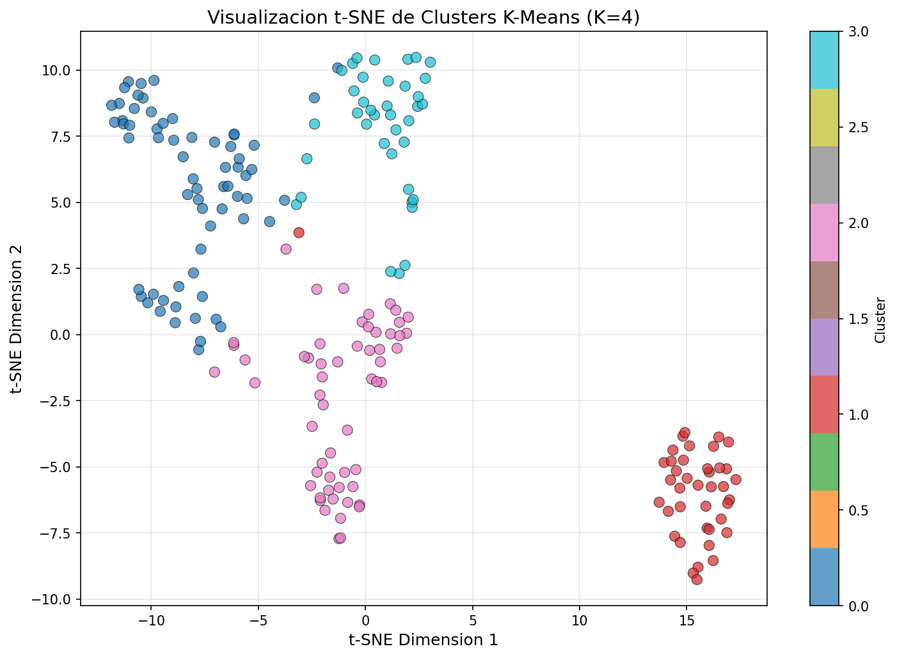

### t-SNE - Perfiles de Clientes

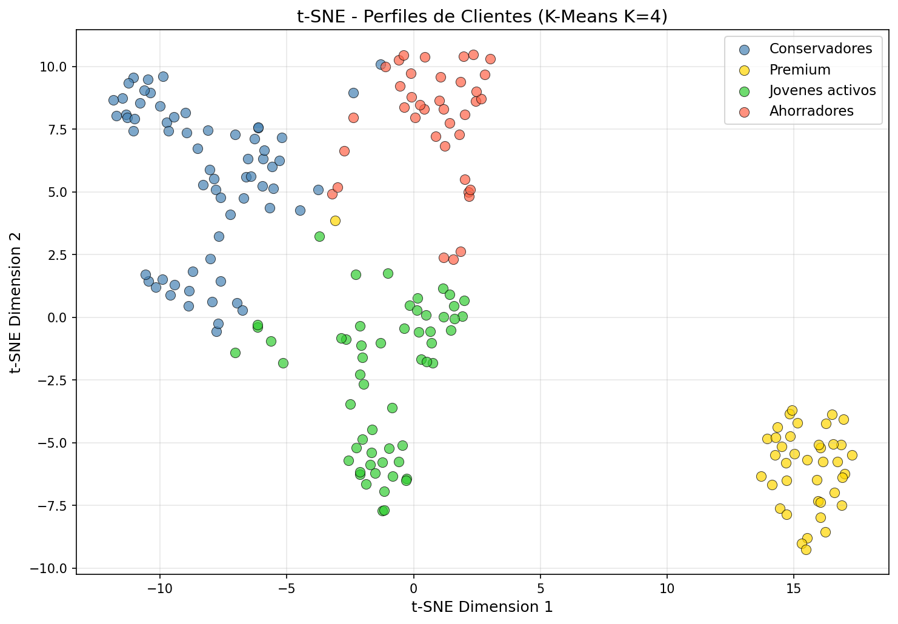

### Comparacion: PCA vs t-SNE

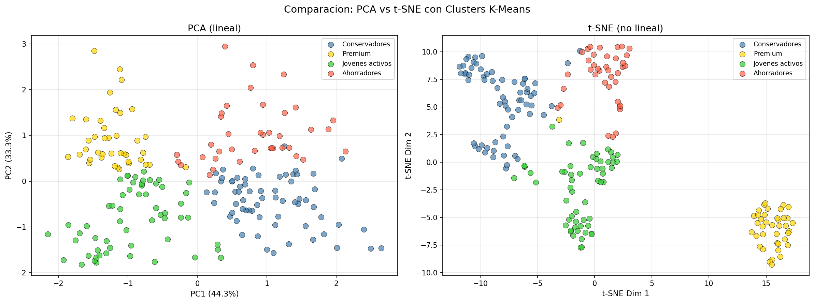

| Aspecto | PCA | t-SNE |
| --- | --- | --- |
| Tipo | Lineal | No lineal |
| Preserva | Varianza global | Estructura local |
| Velocidad | Rapido | Mas lento |
| Interpretabilidad | Alta (combinacion lineal) | Baja (no interpretable directamente) |
| Separacion visual | Buena | Excelente |

---

## Resultados - Etapa 8: Analisis Basico y Resumen Final

Script: `scr/08_AnalisisBasico.py`

Se ejecuto el pipeline completo y se genero un analisis consolidado con el conteo de clusters unicos de ambos algoritmos, los perfiles de clientes detectados y un resumen visual de los 4 metodos aplicados.

### Conteo de Clusters Unicos

| Algoritmo | Clusters | Detalle |
| --- | --- | --- |
| K-Means | 4 | Clusters 0, 1, 2, 3 |
| DBSCAN | 2 + ruido | Clusters 0, 1 y outliers (-1) |

### Resumen Visual - Todos los Metodos

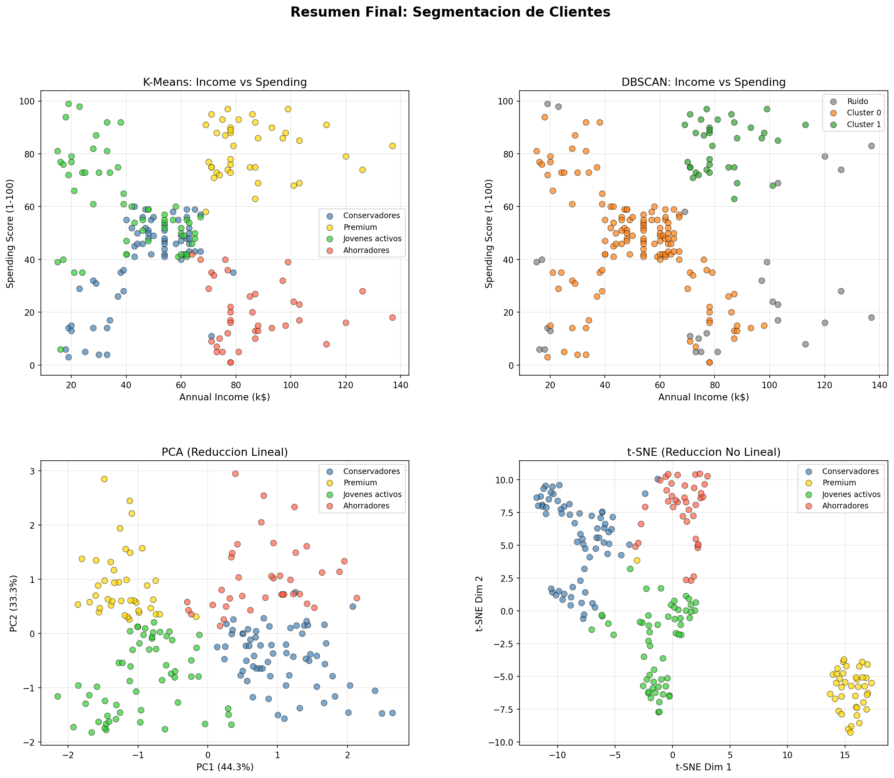

---

## 09 - Conclusiones

### 1. Cuantos clusters parecen ser optimos segun K-Means?

Segun el **metodo del codo**, el numero optimo de clusters es **K=4**. Al graficar la inercia (suma de distancias cuadradas al centroide) para valores de K entre 1 y 9, se observa un claro punto de inflexion en K=4: a partir de ese valor, la reduccion de inercia se vuelve marginal. Esto indica que dividir los datos en mas de 4 grupos no aporta una mejora significativa en la calidad de la segmentacion.


### 2. Como se comparan los resultados entre K-Means y DBSCAN?

| Aspecto | K-Means (K=4) | DBSCAN (eps=0.6, min_samples=5) |
| --- | --- | --- |
| Clusters encontrados | 4 | 2 + ruido |
| Requiere definir K | Si (parametro obligatorio) | No (lo determina automaticamente) |
| Manejo de outliers | No los detecta, los asigna al cluster mas cercano | Los etiqueta como ruido (-1) |
| Forma de clusters | Esfericos (asume grupos compactos) | Arbitraria (basado en densidad) |
| Granularidad | Alta (4 perfiles distintos) | Baja (2 grupos + atipicos) |

K-Means ofrece una **segmentacion mas detallada** con 4 perfiles de clientes claramente diferenciados. DBSCAN, al ser basado en densidad, es mas **conservador**: identifica solo 2 grupos principales (uno general y uno premium) y clasifica como ruido a 28 clientes (14%) con patrones atipicos, principalmente aquellos con ingresos altos pero gasto bajo. Ambos algoritmos son complementarios: K-Means para segmentacion granular y DBSCAN para deteccion de outliers.


### 3. Que aporta PCA/t-SNE a la interpretacion de los clusters?

- **PCA** (Principal Component Analysis) reduce las 3 variables a 2 componentes principales preservando la maxima varianza posible. Permite visualizar la separacion entre clusters en un plano 2D y confirmar que los 4 grupos de K-Means estan bien diferenciados. Al ser una transformacion lineal, los componentes son interpretables como combinaciones ponderadas de las variables originales (Age, Income, Spending).

- **t-SNE** (t-distributed Stochastic Neighbor Embedding) es un metodo no lineal que preserva la estructura local de los datos. Genera agrupaciones visualmente mas compactas y separadas que PCA, revelando patrones no lineales entre los clusters. Es especialmente util para confirmar que los grupos no solo difieren en promedios, sino que forman regiones densas y distintas en el espacio de datos.

Ambas tecnicas son **complementarias**: PCA ofrece una vision global e interpretable, mientras que t-SNE proporciona una vision local mas detallada de la estructura de los clusters.


### 4. Que tipo de perfiles de usuarios/consumidores se detectaron?

Se identificaron **4 perfiles de clientes** mediante K-Means:

| Cluster | Edad Promedio | Ingreso Promedio (k$) | Gasto Promedio | Perfil |
| --- | --- | --- | --- | --- |
| 0 | 54 | 48 | 40 | **Conservadores** |
| 1 | 33 | 86 | 82 | **Premium** |
| 2 | 25 | 40 | 60 | **Jovenes activos** |
| 3 | 39 | 87 | 20 | **Ahorradores** |

- **Cluster 0 - Conservadores** (65 clientes, 32.5%): Clientes de mayor edad (promedio 54 anios) con ingresos y gastos moderados. Representan al consumidor tradicional que gasta de forma proporcional a sus ingresos sin excesos.

- **Cluster 1 - Premium** (40 clientes, 20%): Jovenes adultos (promedio 33 anios) con los ingresos mas altos (86k$) y el mayor nivel de gasto (82/100). Son el segmento mas valioso para el negocio y candidatos ideales para programas de fidelizacion y productos exclusivos.

- **Cluster 2 - Jovenes activos** (57 clientes, 28.5%): Los mas jovenes (promedio 25 anios) con ingresos bajos (40k$) pero gasto medio-alto (60/100). Gastan proporcionalmente mas de lo que ganan, sugiriendo un perfil orientado al consumo y receptivo a ofertas y promociones.

- **Cluster 3 - Ahorradores** (38 clientes, 19%): Adultos de mediana edad (promedio 39 anios) con ingresos altos (87k$) pero el gasto mas bajo (20/100). Tienen alto poder adquisitivo pero eligen no gastar, representando una oportunidad para estrategias de marketing que incentiven el consumo.


## 10 - Memoria Tecnica

A continuacion se detalla el trabajo realizado en cada uno de los scripts del proyecto, describiendo las decisiones tecnicas, los algoritmos aplicados y los resultados obtenidos en cada etapa.

### 10.1 Preparacion del Entorno (`scr/01_Preparacion_Entorno.py`)

Este script valida que el entorno de desarrollo este correctamente configurado antes de iniciar el analisis. Realiza tres verificaciones:

1. **Verificacion de librerias**: Importa pandas, numpy, matplotlib, seaborn y scikit-learn, y muestra la version instalada de cada una. Esto garantiza compatibilidad y reproducibilidad del proyecto.
2. **Verificacion de estructura**: Recorre las carpetas del proyecto (Data, Models, notebooks, results, scr) y confirma que existan en el sistema de archivos.
3. **Verificacion del dataset**: Carga `Mall_Customers.csv` y muestra dimensiones, tipos de datos, estadisticas descriptivas y conteo de valores nulos.

El resultado se exporta como reporte de texto en `results/01_preparacion_entorno_reporte.txt`.

### 10.2 Carga de Datos y EDA (`scr/02_CargaDatos_EDA.py`)

Se realiza el Analisis Exploratorio de Datos (EDA) sobre el dataset Mall_Customers.csv que contiene 200 registros y 5 columnas: CustomerID, Genre, Age, Annual Income (k$) y Spending Score (1-100).

El script ejecuta:

- **Reporte estadistico**: Primeras filas, tipos de datos, estadisticas descriptivas (media, mediana, desviacion estandar, min/max), conteo de valores nulos (0 encontrados) y distribucion por genero.
- **Pairplot**: Grafico de dispersion cruzado entre Age, Annual Income y Spending Score para identificar relaciones visuales entre variables.
- **Histogramas**: Distribucion individual de cada variable numerica con 20 bins.
- **Boxplots**: Deteccion visual de valores atipicos en cada variable.
- **Matriz de correlacion**: Heatmap con coeficientes de Pearson para cuantificar relaciones lineales entre variables.
- **Distribucion por genero**: Grafico de barras mostrando la proporcion Male/Female.

Se generan 5 imagenes PNG y 1 reporte de texto en la carpeta `results/`.

### 10.3 Preprocesamiento (`scr/03_PreProcesamiento.py`)

Antes de aplicar los algoritmos de clustering, es necesario normalizar las variables numericas porque K-Means y DBSCAN calculan distancias euclidianas. Sin escalado, una variable como Annual Income (rango 15-137) tendria mas peso que Spending Score (rango 1-99) simplemente por tener valores mas grandes.

Se aplica **StandardScaler** de scikit-learn, que transforma cada variable para que tenga media=0 y desviacion estandar=1 usando la formula: `z = (x - media) / desviacion_estandar`.

El script genera:

- **Reporte comparativo**: Estadisticas antes y despues del escalado, parametros del scaler (media y desviacion por variable) y verificacion de que las medias resultantes son ~0 y las desviaciones ~1.
- **Comparacion de distribuciones**: Histogramas lado a lado (original vs escalado) para las 3 variables.
- **Boxplots comparativos**: Muestra como las escalas se unifican tras la normalizacion.
- **Pairplot escalado**: Relacion entre variables ya normalizadas.

### 10.4 K-Means Clustering (`scr/04_K-Means.py`)

K-Means es un algoritmo de clustering particional que divide los datos en K grupos minimizando la inercia (suma de distancias cuadradas de cada punto a su centroide).

El script implementa:

1. **Metodo del codo**: Se entrena K-Means para K=1 hasta K=9 y se grafica la inercia resultante. El punto de inflexion en K=4 indica el numero optimo de clusters.
2. **Modelo final (K=4)**: Se entrena con `n_clusters=4`, `random_state=42` y `n_init=10` (10 inicializaciones para evitar minimos locales).
3. **Visualizaciones**: Tres scatterplots de las combinaciones de variables (Income vs Spending, Age vs Spending, Age vs Income) coloreados por cluster asignado.
4. **Reporte**: Inercias por K, distribucion de clientes por cluster, medias de cada variable por cluster e interpretacion automatica de perfiles.

Los 4 clusters identificados corresponden a perfiles de Conservadores, Premium, Jovenes activos y Ahorradores.

### 10.5 DBSCAN Clustering (`scr/05_DBSCAN.py`)

DBSCAN (Density-Based Spatial Clustering of Applications with Noise) es un algoritmo basado en densidad que no requiere especificar el numero de clusters. Agrupa puntos que estan densamente conectados y etiqueta como ruido (-1) a los que no pertenecen a ninguna region densa.

Parametros utilizados:

- **eps=0.6**: Radio maximo para considerar que dos puntos son vecinos.
- **min_samples=5**: Minimo de puntos dentro del radio eps para formar un core point.

El script genera:

1. **Scatterplots**: Income vs Spending y Age vs Spending, con clusters en colores y ruido en gris. La leyenda muestra la cantidad de puntos por grupo.
2. **Comparacion K-Means vs DBSCAN**: Grafico lado a lado mostrando las diferencias entre ambos enfoques.
3. **Reporte**: Parametros, numero de clusters encontrados (2), puntos de ruido (28, 14%), medias por cluster con y sin ruido, e interpretacion comparativa.

DBSCAN identifica 2 grupos (uno general y uno premium) y clasifica como outliers a clientes con ingresos altos pero gasto bajo.

### 10.6 PCA - Reduccion de Dimensionalidad (`scr/06_PCA_RedDim.py`)

PCA (Principal Component Analysis) es una tecnica lineal que reduce la dimensionalidad transformando las variables originales en componentes principales ortogonales, ordenados por varianza explicada.

Se reduce de 3 dimensiones (Age, Income, Spending) a 2 componentes principales (PC1, PC2). Cada componente es una combinacion lineal de las variables originales: `PC1 = a*Age + b*Income + c*Spending`.

El script genera:

1. **PCA con clusters K-Means**: Scatterplot PC1 vs PC2 coloreado por cluster, confirmando la separacion de los 4 grupos en el espacio reducido.
2. **Varianza explicada**: Grafico de barras mostrando el porcentaje de varianza capturado por cada componente y la varianza acumulada.
3. **PCA con perfiles**: Scatterplot con leyenda descriptiva por perfil de cliente.
4. **Reporte**: Varianza explicada, composicion de componentes (pesos de cada variable), medias por cluster en espacio PCA y en variables originales.

### 10.7 t-SNE - Reduccion de Dimensionalidad (`scr/07_t-SNE_RedDim.py`)

t-SNE (t-distributed Stochastic Neighbor Embedding) es una tecnica no lineal disenada para visualizacion. A diferencia de PCA, t-SNE preserva la estructura local: puntos que estaban cerca en el espacio original permanecen cerca en 2D.

Parametros utilizados:

- **n_components=2**: Reduccion a 2 dimensiones.
- **perplexity=30**: Numero de vecinos cercanos que t-SNE considera (controla el balance entre estructura local y global).
- **learning_rate=200**: Velocidad de optimizacion del algoritmo.
- **random_state=42**: Semilla para reproducibilidad.

El script genera:

1. **t-SNE con clusters K-Means**: Scatterplot mostrando agrupaciones mas compactas que PCA.
2. **t-SNE con perfiles**: Leyenda descriptiva por tipo de cliente.
3. **Comparacion PCA vs t-SNE**: Grafico lado a lado evidenciando que t-SNE logra una separacion visual superior.
4. **Reporte**: Parametros, KL divergence (metrica de calidad), medias en espacio t-SNE y tabla comparativa detallada entre ambas tecnicas.

### 10.8 Analisis Basico y Resumen (`scr/08_AnalisisBasico.py`)

Este script ejecuta el pipeline completo de principio a fin (carga, escalado, K-Means, DBSCAN, PCA, t-SNE) y consolida todos los resultados en un analisis final.

Genera:

1. **Conteo de clusters unicos**: K-Means (4 clusters: 0, 1, 2, 3) vs DBSCAN (2 clusters + ruido: -1, 0, 1).
2. **Perfiles detallados**: Descripcion de cada cluster con edad, ingreso y gasto promedio, nombre del perfil y cantidad de clientes.
3. **Resumen visual**: Panel 2x2 con los 4 metodos (K-Means, DBSCAN, PCA, t-SNE) en una sola imagen para comparacion directa.
4. **Reporte final**: Resumen comparativo de todos los algoritmos y conclusiones del proyecto.

### Flujo de ejecucion

Los scripts estan disenados para ejecutarse de forma independiente y secuencial:

```bash
python scr/01_Preparacion_Entorno.py
python scr/02_CargaDatos_EDA.py
python scr/03_PreProcesamiento.py
python scr/04_K-Means.py
python scr/05_DBSCAN.py
python scr/06_PCA_RedDim.py
python scr/07_t-SNE_RedDim.py
python scr/08_AnalisisBasico.py
```

Cada script carga el dataset original y aplica su propio preprocesamiento, lo que garantiza independencia entre etapas y facilita la ejecucion individual para depuracion o revision.

## Tecnologias Utilizadas

- Python 3.x
- pandas, numpy
- matplotlib, seaborn
- scikit-learn (KMeans, DBSCAN, PCA, TSNE, StandardScaler)
